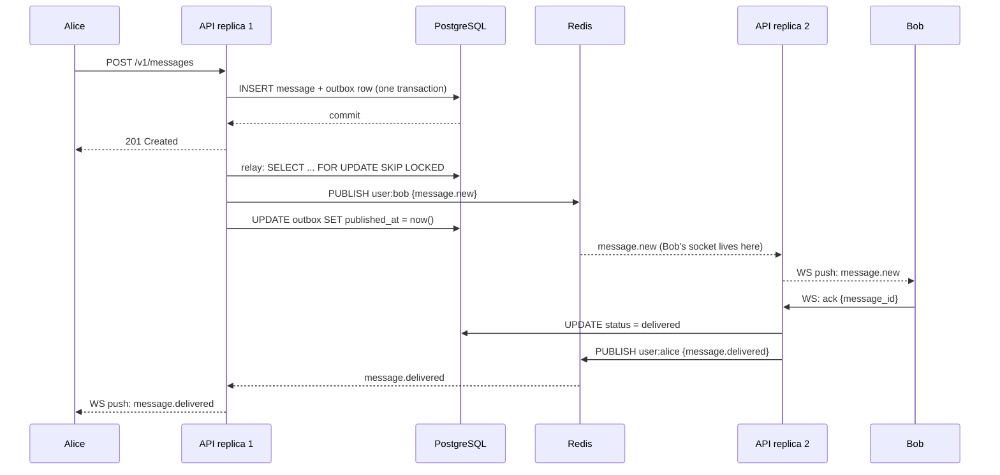
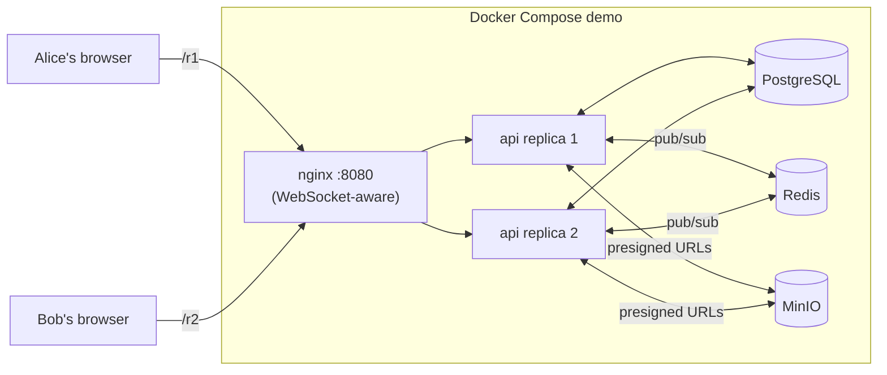
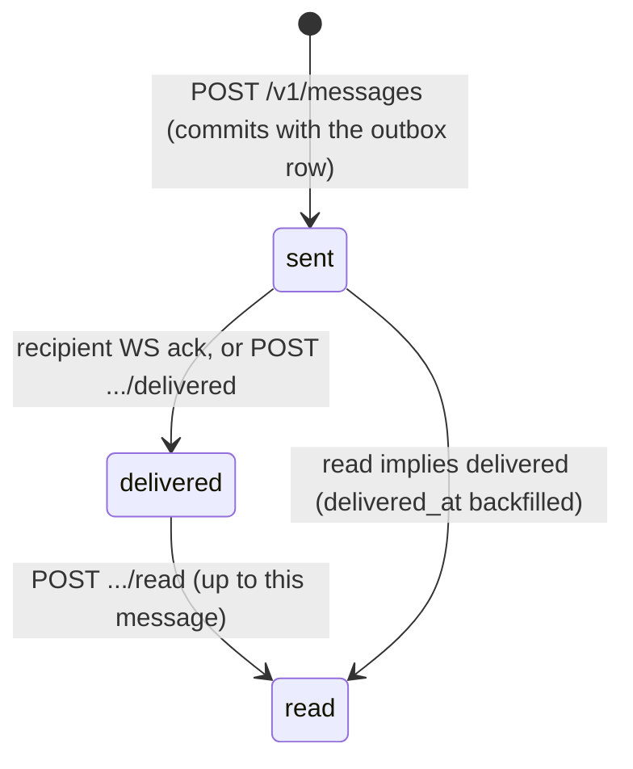

# Realtime 1:1 Chat Backend

A reference implementation of a real-time 1:1 messaging backend: REST + WebSocket, atomic
persistence through a transactional outbox, sent/delivered/read receipts, emoji and small
attachment support, and Redis fan-out so it keeps working across multiple API replicas.

**Stack:** Python 3.12 · FastAPI · async SQLAlchemy 2 + asyncpg · Alembic · PostgreSQL 16 ·
Redis 7 · MinIO (S3-compatible) · `uv` · Docker.

## Quickstart

```bash
git clone https://github.com/Roydon/fastapi-realtime-chat-backend.git
cd fastapi-realtime-chat-backend
make up
```

Open **http://localhost:8080/demo/** - two panes, Alice and Bob, each pinned to a
different API replica. Send text, emoji, or an image; watch ✓ sent -> ✓✓ delivered ->
blue ✓✓ read update live, and typing indicators appear as you type.

Other useful targets: `make test` (full suite against real Postgres/Redis/MinIO
containers), `make lint` (ruff + mypy), `make down` (tear down), `make loadtest` (k6, see
[Results](#results)). Full list: `make help`.

## How it works



**Why a transactional outbox, and why Redis fan-out:**

* The message row and the "notify these users" row are written in the *same* database
  transaction. If the write fails, nothing is queued to push; if it succeeds, a push is
  guaranteed - eventually, at-least-once - even if the API crashes right after committing.
  A background relay on every replica publishes pending rows to Redis and marks them
  published (`FOR UPDATE SKIP LOCKED` lets replicas share the work safely).
* Redis pub/sub means the sender and recipient can be connected to *different* API
  replicas. No sticky sessions, no pod-to-pod calls: whichever replica holds a user's live
  socket is subscribed to that user's channel and pushes the event. See
  [docs/deployment.md](docs/deployment.md#why-this-design-needs-no-sticky-sessions).
* A recipient who is offline entirely misses nothing: `GET /v1/conversations/{id}/messages?after=<cursor>`
  replays everything committed since their last-seen message, in order.



## API

Full interactive docs at `/docs` (Swagger UI) once running; machine-readable schema at
[`docs/openapi.json`](docs/openapi.json).

| Method | Path | Purpose |
|---|---|---|
| `POST` | `/v1/messages` | Send a message. Idempotent on `client_msg_id` - a retry with the same id returns the original message (200) instead of creating a duplicate (201). |
| `POST` | `/v1/messages/{id}/delivered` | Recipient confirms delivery. |
| `POST` | `/v1/conversations/{id}/read` | Mark messages up to and including one message as read. |
| `GET` | `/v1/conversations` | List conversations with last message + unread count. |
| `GET` | `/v1/conversations/{id}/messages` | History (`before=`) or catch-up sync (`after=`), cursor-paginated. |
| `POST` | `/v1/attachments/presign` | Presigned POST for a direct-to-storage upload (size/MIME enforced by the storage service itself). |
| `GET` | `/healthz` / `/readyz` / `/metrics` | Liveness / readiness (DB + Redis) / Prometheus. |

Every error response is `{"code": "...", "message": "...", "request_id": "..."}` with a
matching HTTP status.

### WebSocket - `/v1/ws`

Authenticate with `?token=<jwt>` (browsers cannot set headers on the WebSocket handshake)
or `Sec-WebSocket-Protocol: bearer, <jwt>`.

| Direction | Event | Payload |
|---|---|---|
| server -> client | `hello` | `{user_id, replica, heartbeat_seconds}` on connect |
| server -> client | `message.new` | full message object |
| server -> client | `message.delivered` | `{message_id, conversation_id, client_msg_id, delivered_at}` |
| server -> client | `message.read` | `{conversation_id, reader_id, message_ids[], read_at}` |
| server -> client | `typing` | `{conversation_id, user_id, is_typing}` |
| server -> client | `ping` / `error` | keepalive / `{code, message}` |
| client -> server | `ack` | `{message_id}` - marks delivered |
| client -> server | `read` | `{conversation_id, up_to_message_id}` |
| client -> server | `typing` | `{conversation_id, is_typing}` |
| client -> server | `ping` / `pong` | keepalive |

### Delivery state machine



## Integrating your existing auth

The API never issues real tokens; it verifies them. One dependency, `get_current_user()`,
supports two modes via `AUTH_MODE`:

* **`jwks`** (production): set `JWKS_URL` to your identity provider's JWKS endpoint, plus
  `JWT_ISSUER` / `JWT_AUDIENCE` if you want those checked, and `JWT_USER_CLAIM` if your
  tokens carry the user id somewhere other than `sub`. Keys are cached and refreshed
  automatically ([`app/auth.py`](app/auth.py)).
* **`hs256`** (demo/tests): a shared `JWT_SECRET`; `tools/mint_token.py` issues tokens for
  `alice`/`bob` for local testing.

The same verifier authenticates the WebSocket handshake, so there is exactly one place
that understands your tokens.

## Tests

```bash
make test        # full suite: real Postgres/Redis/MinIO via testcontainers
make test-cov     # with a coverage gate (>= 85% on app/)
```

67 tests cover: send/receive over REST and WebSocket, delivered + read receipts,
idempotent resend with the same `client_msg_id` (including a same-id-different-body
conflict), reconnect + catch-up sync, cross-replica fan-out (two independent app
instances sharing one Redis), a database failure during send returning 5xx with **no**
push emitted, attachment size/MIME rejection at the storage layer, and JWKS-mode auth.
CI runs the same suite on every push - see the badge below once you enable Actions on
your fork.

## Results

**Cross-replica messaging verified live on AWS EKS**, 2026-09-11:

| Metric | Value | Notes |
|---|---|---|
| **Test suite** | 67 passed, 89% coverage on `app/` | Runs against real Postgres/Redis/MinIO via testcontainers |
| **Cross-replica delivery** | ✓ sent → ✓✓ delivered → blue ✓✓ read | Live smoke test: message from pod A, received on pod B, via Redis fan-out |
| **Deployment target** | AWS EKS, dedicated namespace | Isolated with NetworkPolicy + ResourceQuota; teardown is a single namespace delete |
| **Local Docker Compose** | Up and healthy | `make up` works; demo at http://localhost:8080/demo/ (pending docker-compose install on this Mac) |

For load-test capacity (p95 latency, sustained throughput), run `make loadtest` against the Compose stack
on a machine with k6 installed, or deploy to a dedicated perf environment.

## Limitations

* The demo's `AUTH_MODE=hs256` and `/v1/demo/token` endpoint are for local demonstration
  only; they are disabled unless `DEMO_ENABLED=true` and refuse to mount alongside
  `AUTH_MODE=jwks`.
* Attachments are validated for size and MIME type but not scanned for content (no
  antivirus/EXIF-stripping step) - add one before accepting attachments from untrusted
  users in production.
* Redis pub/sub is a single logical bus; very large deployments should shard it (see
  [docs/deployment.md](docs/deployment.md#scaling-notes)).
* No group chat, message editing/deletion, or push notifications to a native mobile app
  (APNs/FCM) - this is scoped to 1:1 web/WebSocket messaging as specified.
* `docker-compose.yml` uses `tmpfs` for Postgres/Redis/MinIO data so `make down` always
  starts clean; swap in named volumes if you want the demo data to persist across restarts.

## Deployment

See [docs/deployment.md](docs/deployment.md) for Kubernetes manifests and an AWS
(ECS/EKS + RDS + ElastiCache + S3) reference architecture.

## License

[MIT](LICENSE)
